<div align="center">

# 🚁 HelixSim

**A real-time, parametric quadrotor flight simulator**
*Cascade-PID flight control · PyBullet physics · Ursina 3D visualization*

Built during the **AICTE Samarthan Robotics Internship** at the **Centre for Robotics, IIT Palakkad**

</div>

---

## 🧠 What is this?

HelixSim is a **dual-window** drone simulator: one window is a control station (configure + monitor), the other is a pure 3D visualizer, built to run side-by-side on a dual-monitor rig. Under the hood, a cascaded-PID flight controller chases whatever trajectory you throw at it, PyBullet handles the rigid-body physics, and the whole thing runs across **three separate OS processes** so the visuals never stutter no matter how heavy the physics loop gets.

<div align="center">

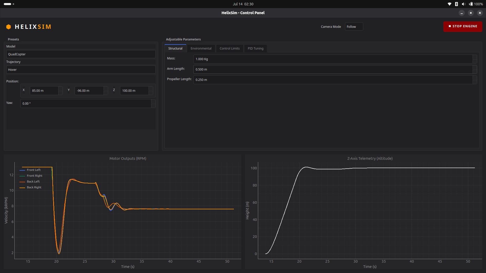
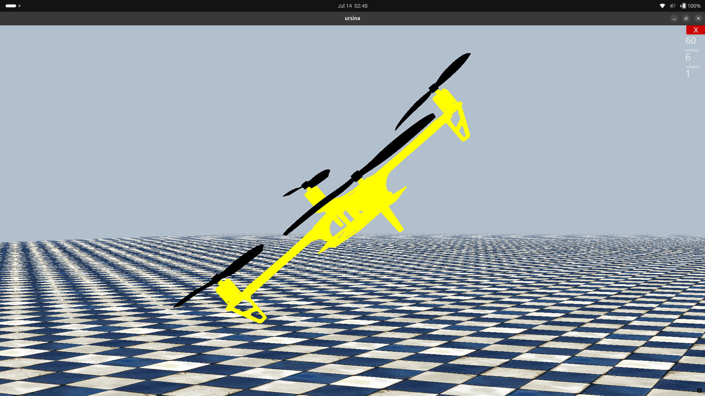

<sub>Control station (left) driving the Ursina visualizer (right) on a second monitor</sub>

</div>

---

## ✨ Features

| | |
|---|---|
| 🎛️ **Modern control station** | Header (camera + start/stop), live-editable parameter panel, telemetry graphs |
| 🌀 **Cascade PID flight control** | Thrust / Roll / Pitch cascaded loops + single-loop Yaw |
| 📐 **3 trajectory presets** | Hover · Straight Line · Circular Loop — each with independent yaw target |
| 🎥 **3 camera modes** | Follow (lerp-smoothed cinematic) · Fixed (rigid tracking) · Origin (static overview) |
| 📊 **Live telemetry** | Per-motor RPM (color-coded) + altitude, streamed at 60 Hz via PyQtGraph |
| 🧵 **True multiprocessing** | UI / Physics / Visualizer run as isolated processes — 240 Hz physics with zero UI-induced lag |
| 🛩️ **Model presets** | Quadcopter (✅ flying) · Octacopter (🚧 mixing matrix ready, motor rig pending) |

---

## 🎬 Demo

Each trajectory shown from the visualizer's flight view, paired with the live control station telemetry driving it.

**Visualizer**

<table>
<tr>
<td width="33%" align="center">
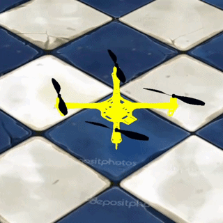<br>
<sub><b>Hover</b></sub>
</td>
<td width="33%" align="center">
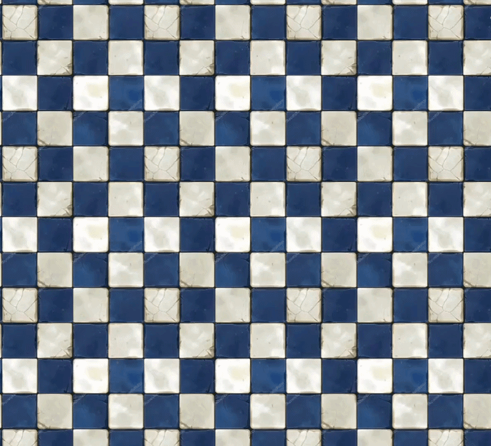<br>
<sub><b>Straight Line</b></sub>
</td>
<td width="33%" align="center">
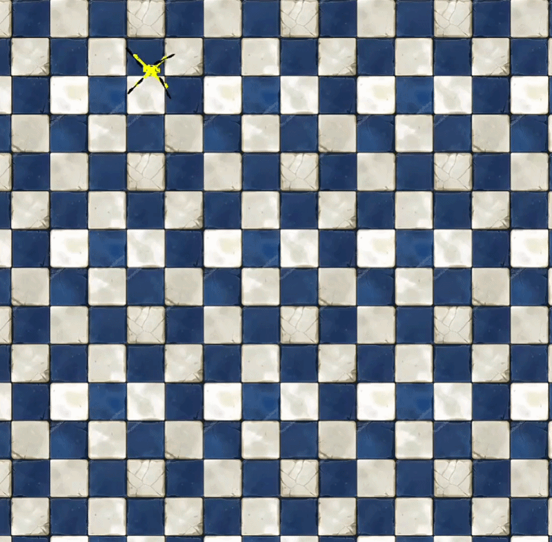<br>
<sub><b>Circular Loop</b></sub>
</td>
</tr>
</table>

**Control Station**

<table>
<tr>
<td width="33%" align="center">
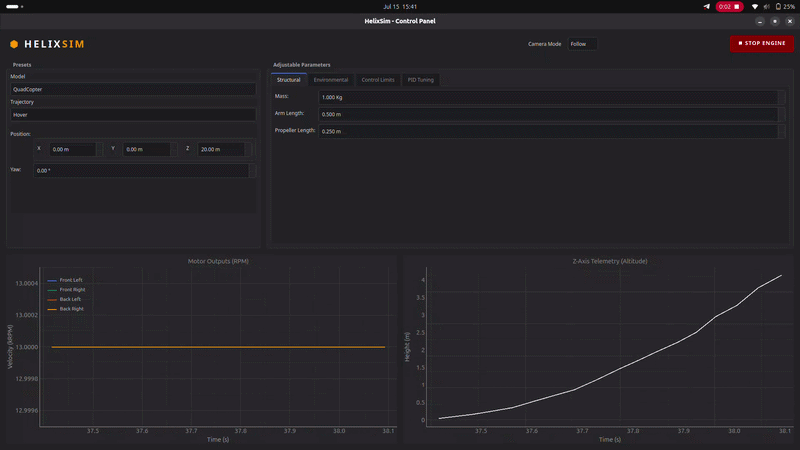<br>
<sub><b>Hover</b></sub>
</td>
<td width="33%" align="center">
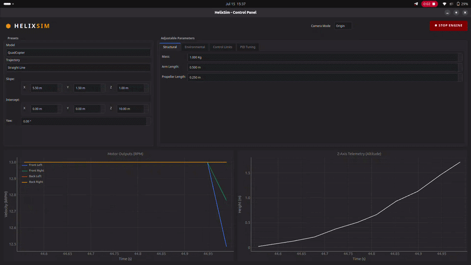<br>
<sub><b>Straight Line</b></sub>
</td>
<td width="33%" align="center">
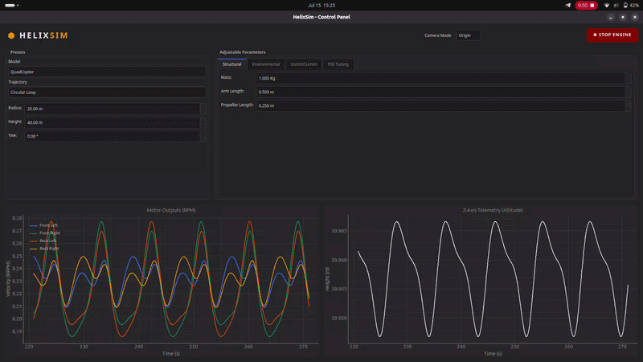<br>
<sub><b>Circular Loop</b></sub>
</td>
</tr>
</table>

---

## 🖥️ Control Station Walkthrough

The control station window is split into 3 zones:

1. **Header** — switch camera mode, start/stop the simulation
2. **Parameter Panel** — model preset, trajectory preset, PID gains, environmental params
3. **Telemetry** — live RPM (per motor, color-coded) + altitude graphs, rendered with PyQtGraph

### Camera Modes

<table>
<tr>
<td align="center" width="33%">
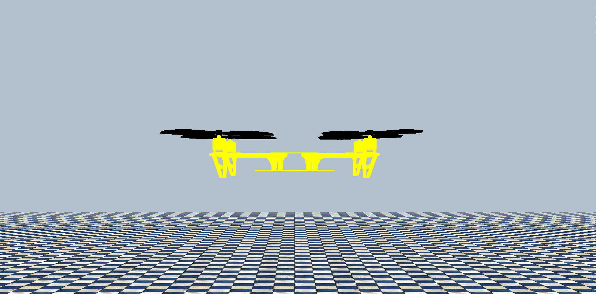<br>
<b>Follow Cam</b><br>
<sub>Vector-lerp smoothed, cinematic</sub>
</td>
<td align="center" width="33%">
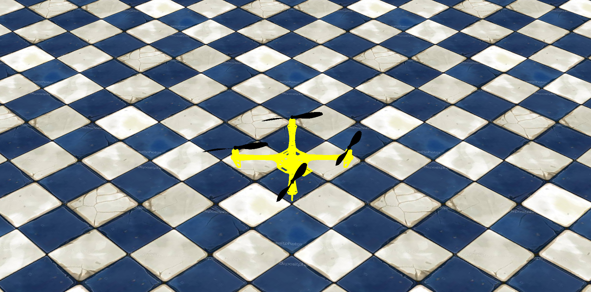<br>
<b>Fixed Cam</b><br>
<sub>Constant-speed tracking, rotation locked</sub>
</td>
<td align="center" width="33%">
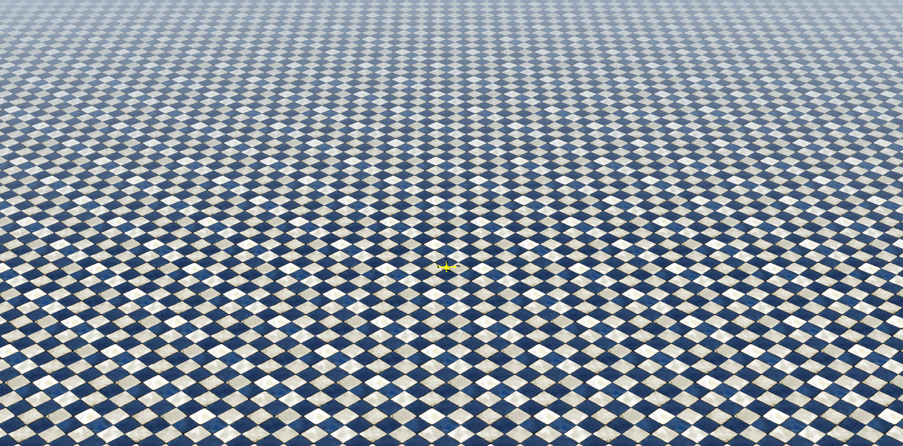<br>
<b>Origin Cam</b><br>
<sub>Static at (200, 200, -200)</sub>
</td>
</tr>
</table>

---

## ⚙️ How the Flight Stack Works

```
 Trajectory Manager                Flight Controller                  Physics Engine
┌───────────────────┐   target   ┌────────────────────┐   RPM      ┌────────────────────┐
│ Hover               │  pos/yaw  │ Cascade PID          │ per motor │ PyBullet rigid body │
│ Straight Line       ├──────────►│ Thrust/Roll/Pitch    ├──────────►│  force = k_T·ω²     │
│ Circular Loop       │           │ (cascaded) + Yaw     │           │ torque = k_M·ω²     │
└───────────────────┘             │ (single loop)        │           └─────────┬──────────┘
                                   └──────────┬───────────┘                     │
                                              │ [thrust,roll,pitch,yaw]         │ DroneState
                                              ▼                                 ▼
                                        Motor Mixing                 broadcast @ 60 Hz
                                        (X-frame quad)           ────► UI + Visualizer
```

**Motor mixing matrix (quadcopter, X-frame):**

```
        | Thrust | Roll | Pitch | Yaw |
   M1   |    1   |   1  |  -1   | -1  |
   M2   |    1   |  -1  |  -1   |  1  |
   M3   |    1   |   1  |   1   |  1  |
   M4   |    1   |  -1  |   1   | -1  |
```

**Data flow, end to end:**

1. User picks a model preset + trajectory preset and tunes parameters in the control station
2. Model loads instantly into the Ursina visualizer
3. Trajectory config → `TrajectoryManager` builds the live trajectory function
4. Remaining settings → `PhysicsEngine`, which steps the sim at **240 Hz**
5. Each tick: `TrajectoryFlightController` compares current vs. target position → cascade PID → `[thrust, roll, pitch, yaw]` → motor mixing → per-motor RPM
6. RPM feeds back into the physics engine → per-motor force/torque → `PyBullet.stepSimulation()`
7. Resulting `DroneState` (position, velocity, orientation, RPM) is broadcast to the UI + visualizer at **60 Hz**

<div align="center">
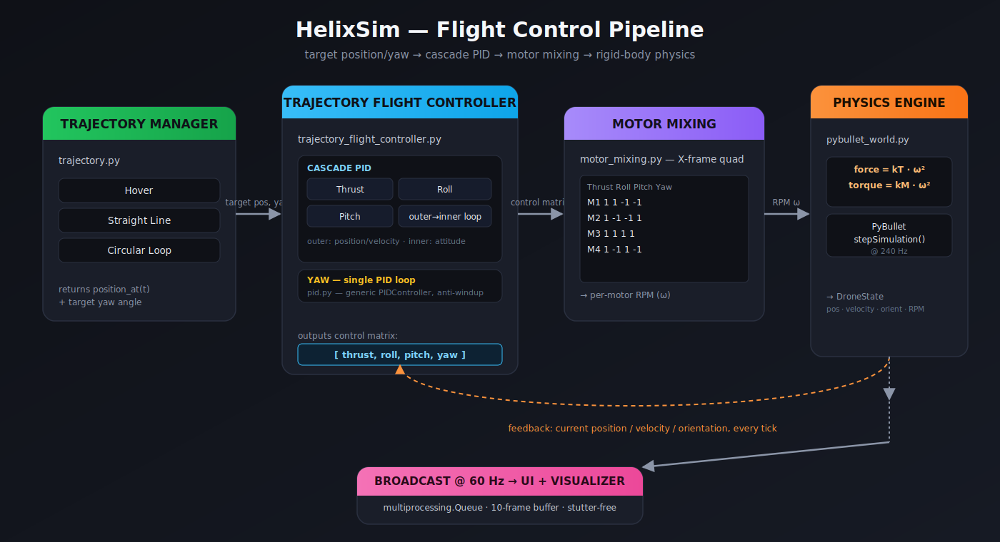
</div>

---

## 🧵 The Multiprocessing Problem (the fun part)

HelixSim runs as **3 independent processes**: UI (main process), Physics Engine, Visualizer. Getting data between them without lag was the hardest part of this build.

<div align="center">
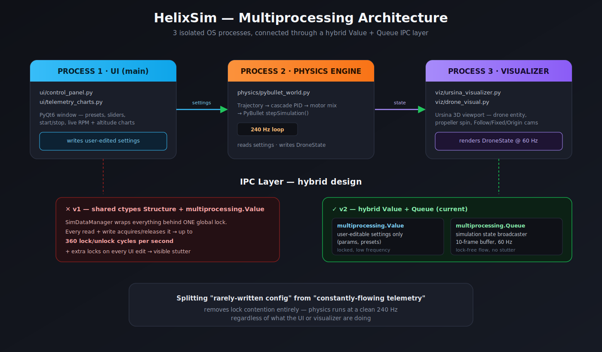
</div>

**v1 — shared memory + global locks** ❌
A custom `ctypes.Structure`-backed `SimDataManager`, wrapped around `multiprocessing.Value`. Every read *and* write required a lock — up to **360 lock/unlock cycles per second**, plus an extra lock every time the user touched a UI control. Result: visible stutter.

**v2 — hybrid Value + Queue (current)** ✅

| Data type | Mechanism | Frequency |
|---|---|---|
| User-editable settings (params, presets) | `multiprocessing.Value` | on-change |
| Live simulation state (position, velocity, RPM) | `multiprocessing.Queue` broadcaster, 10-frame buffer | 60 Hz |

Splitting *config* (rarely written, needs locking) from *telemetry* (constantly written, needs to just flow) removed the lock-contention bottleneck entirely.

---

## 📁 Project Structure

```
HelixSim/
├── main.py                          # 🔌 Wiring only — instantiates every module and starts the 3 processes
│
├── sim/                             # Pure math — the "physics-free" layer, first target for future C++ port
│   ├── data_class.py                #   SimDataManager + ctypes Structures (StructParam, EnvParam, ...) — shared state
│   ├── motor_mixing.py              #   Quad-copter (+ future Octo) mixing matrix: [thrust,roll,pitch,yaw] → per-motor RPM
│   └── trajectory.py                #   TrajectoryManager — Hover / Straight Line / Circular Loop position_at(t) functions
│
├── control/                         # The "brain" — no PyBullet or UI dependencies
│   ├── pid.py                       #   Generic PIDController (kp/ki/kd, anti-windup, angle-error mode)
│   └── trajectory_flight_controller.py  # Cascade PID stack: target pos → [thrust,roll,pitch,yaw] control matrix
│
├── physics/
│   └── pybullet_world.py            # PhysicsEngine — owns the PyBullet world, steps at 240 Hz, applies motor forces/torques
│
├── ui/                               # Control station window (PyQt6)
│   ├── control_panel.py             #   ControlPanel — header, presets, editable params, start/stop
│   └── telemetry_charts.py          #   TelemetryChart — live RPM + altitude graphs via PyQtGraph
│
├── viz/                              # Visualizer window (Ursina)
│   ├── visualizer_base.py           #   VizBase — abstract contract (run/initialize/update/...) for swappable render engines
│   ├── ursina_visualizer.py         #   UrsinaVisualizer — scene setup, camera modes, custom fog shader, per-frame update
│   └── drone_visual.py              #   DroneViz — the drone entity hierarchy (body + 4 propeller discs)
│
├── assets/                           # Static files
│   ├── drone.urdf                   #   URDF description consumed by PyBullet (mass, arms, inertia)
│   ├── drone.obj / propeller.obj    #   3D meshes rendered by the visualizer
│   └── tile.jpeg                    #   Ground texture
│
├── config/
│   └── defaults.yaml                # PID gains, sim frequencies, default drone + trajectory params — no code changes needed
│
└── requirements.txt
```

<sub>💡 The layering is deliberate: `sim/` and `control/` know nothing about PyBullet, Ursina, or Qt — only `physics/`, `ui/`, and `viz/` touch their respective external engines. `main.py` is the only file that imports everything.</sub>

---

## 🛠️ Tech Stack

<div align="center">

| Physics | Control | GUI | Telemetry | 3D Viz | Numerics | Config |
|:---:|:---:|:---:|:---:|:---:|:---:|:---:|
| PyBullet | Cascade PID (pure Python) | PyQt6 | PyQtGraph | Ursina | NumPy · SciPy | PyYAML |

</div>

---

## 🚀 Getting Started

```bash
git clone https://github.com/harshk-dev/HelixSim.git
cd HelixSim
pip install -r requirements.txt
python main.py
```

This launches the control station and the Ursina visualizer as separate processes. Pick a model preset, pick a trajectory, hit ▶ Start.

---

## 🗺️ Roadmap

- [ ] Working octacopter motor rig (mixing matrix already exists)
- [ ] Live structural param tuning — mass, arm length, propeller geometry
- [ ] Wind gust / turbulence model
- [ ] ESC latency + sensor noise simulation
- [ ] General CAD model import for custom frames

---

## 🙏 Acknowledgements

Built as part of the **AICTE Samarthan Robotics Internship**, Centre for Robotics, **IIT Palakkad**, under the supervision of **Prof. Santhakumar Mohan**.

## 📄 License

MIT — see `LICENSE`.